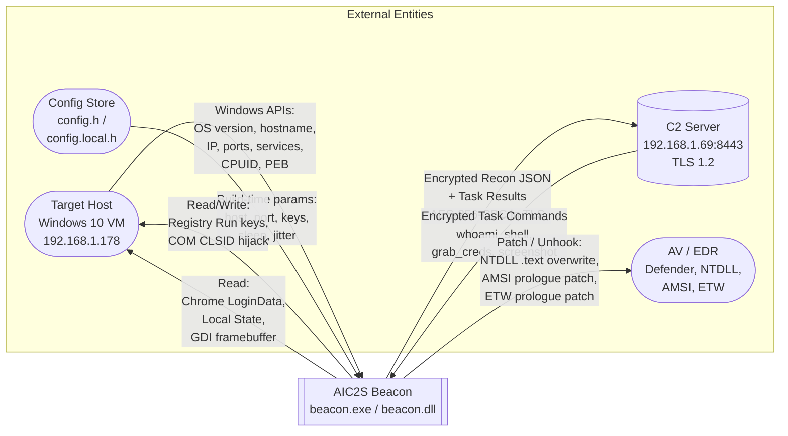
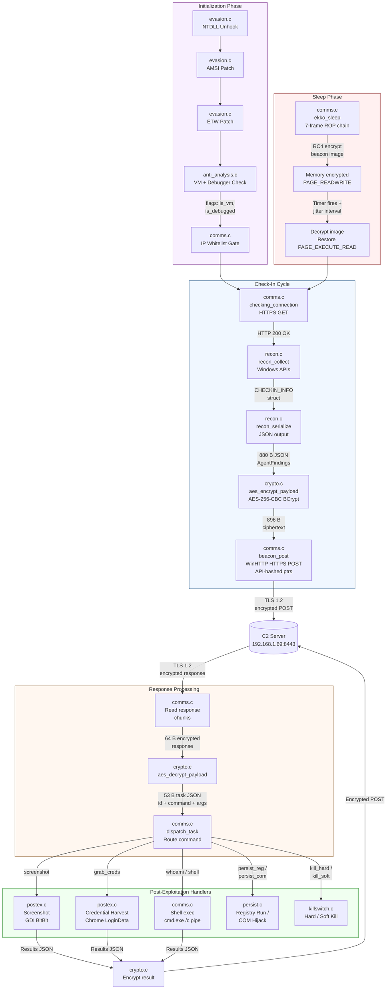

# AIC2S Beacon — Data Flow Diagrams

## Level 0 DFD — Beacon Context Diagram

The beacon as a single process interacting with external entities.

---

## Level 1 DFD — Internal Module Data Flow

Decomposition of the beacon process into modules showing the check-in cycle.

---

## Data Flow Summary Table

| # | Source | Data | Destination | Description |
|---|--------|------|-------------|-------------|
| 1 | Target Host (Windows APIs) | OS, hostname, username, IP, ports, services | recon.c | Host reconnaissance collection |
| 2 | recon.c | CHECKIN_INFO struct (15+ fields) | recon_serialize() | Struct-to-JSON conversion |
| 3 | recon_serialize() | 880 B AgentFindings JSON | crypto.c | Plaintext ready for encryption |
| 4 | crypto.c (encrypt) | 896 B AES-256-CBC ciphertext | comms.c beacon_post() | Encrypted payload for transmission |
| 5 | comms.c beacon_post() | HTTPS POST (TLS 1.2) | C2 Server (8443/tcp) | Encrypted check-in over network |
| 6 | C2 Server | 64 B encrypted task response | comms.c (recv) | Task command from operator |
| 7 | crypto.c (decrypt) | 53 B task JSON (id, command, args) | dispatch_task() | Decrypted command for routing |
| 8 | dispatch_task() | Command + args | Handler module | Route to appropriate handler |
| 9 | postex.c (screenshot) | 4,024 B GDI capture | crypto.c → comms.c | Screenshot exfiltration |
| 10 | postex.c (creds) | 237,922 B base64 bundle | crypto.c → comms.c | Credential exfiltration |
| 11 | evasion.c | Clean .text bytes (1,151,574 B) | In-memory NTDLL | EDR hook removal |
| 12 | evasion.c | Patched prologue bytes | AMSI (amsi.dll) | Disable content scanning |
| 13 | evasion.c | Patched prologue bytes | ETW (ntdll.dll) | Suppress event telemetry |
| 14 | comms.c (Ekko) | RC4-encrypted PE image | Beacon memory pages | Sleep-time memory obfuscation |
| 15 | persist.c | Registry value / CLSID entry | Windows Registry | Boot persistence |
| 16 | anti_analysis.c | CPUID + debug port results | recon.c (flags) | Environment detection |
| 17 | config.h | Macros (host, port, keys, sleep) | All modules | Build-time configuration |
